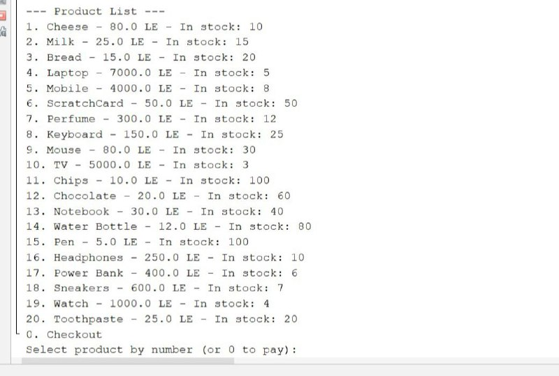
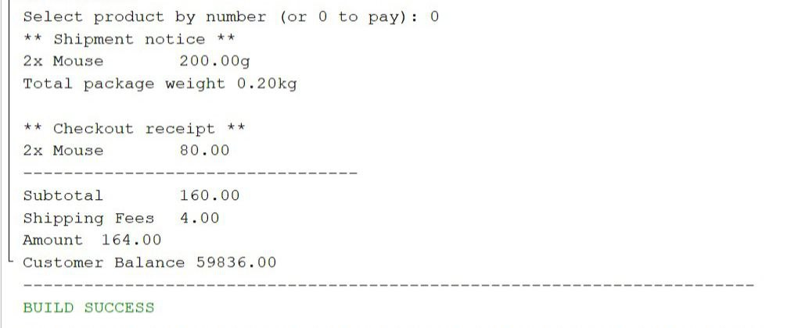

# Shopping Cart System

This project simulates a simple shopping system using a text-based interface, where the user can browse products, choose quantities, and proceed to checkout.

---

## Product List Display

The program displays a list of all available products, including the price and stock for each item:

---

## Adding a Product to the Cart

In this step, product number 9 (Mouse) was selected, and 2 units were added to the cart:

---

## Checkout Process

After selecting the products, the user proceeds to checkout. The program shows a summary of the receipt, including shipping fees, total amount, and the remaining customer balance:

